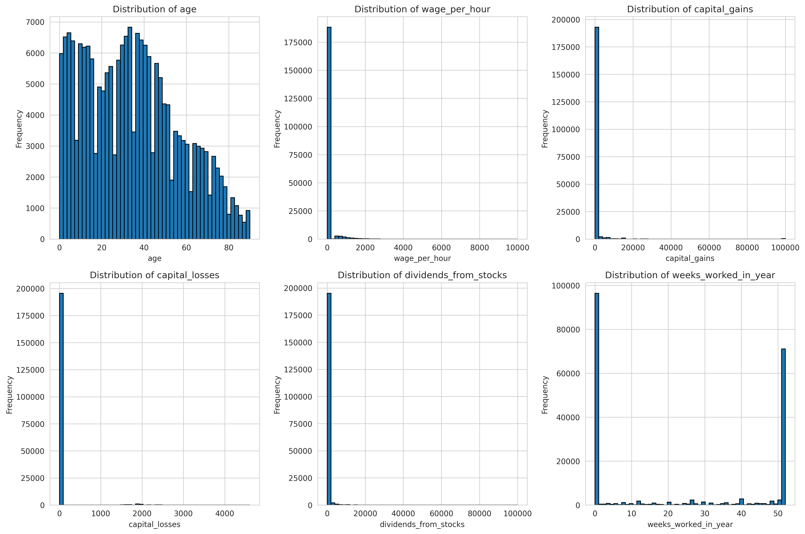
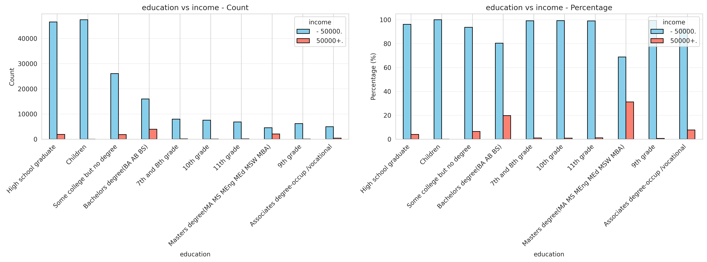
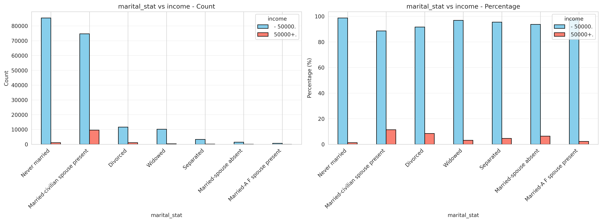
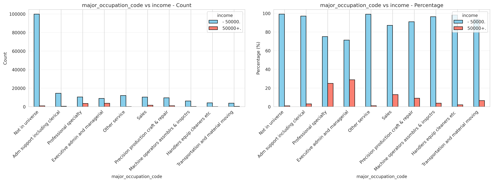
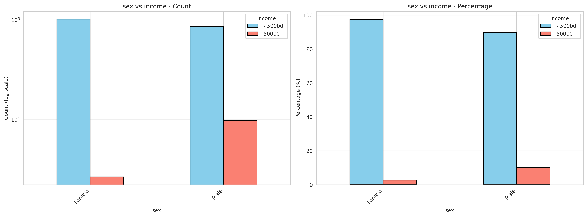
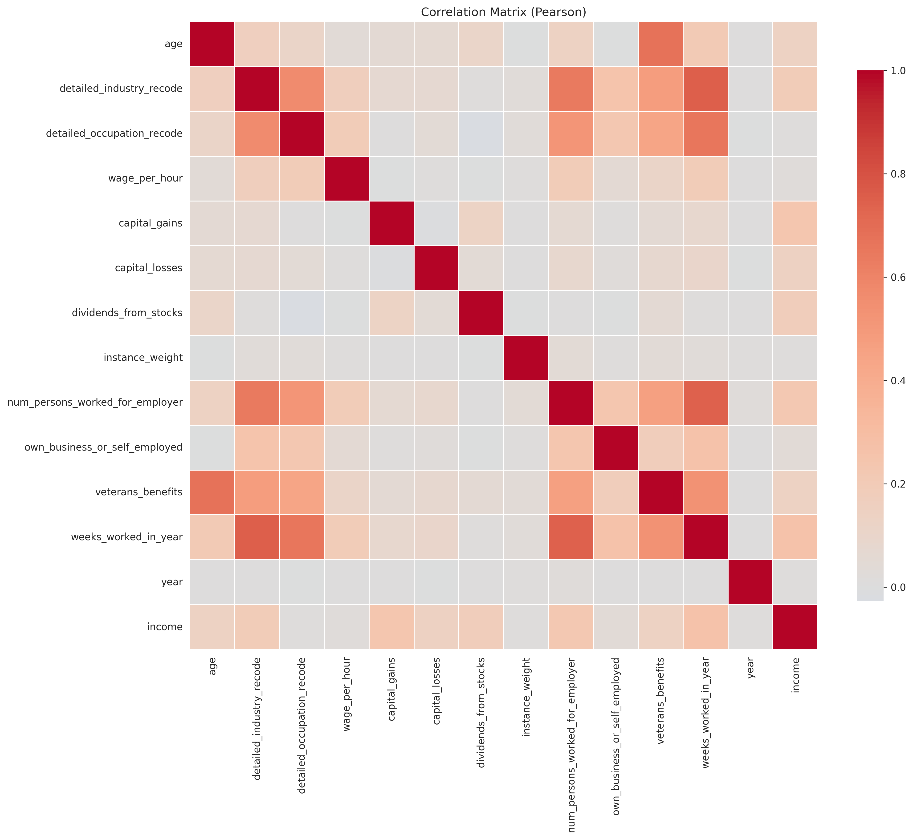

# Exploratory Data Analysis Report
## Census Income Prediction Project

**Date:** 2025-11-07  
**Dataset:** Census Income (Adult) Dataset  
**Analysis Type:** Exploratory Data Analysis (EDA)

---

## Executive Summary

This report presents a comprehensive exploratory data analysis of the Census Income dataset, which contains demographic and employment information used to predict whether an individual's income exceeds $50,000 per year. The analysis reveals a **severely imbalanced classification problem** with only 6.21% of samples in the positive class, requiring specialized modeling approaches.

**Key Findings:**
- Dataset contains ~200K training samples with 41 features (13 numerical, 29 categorical)
- Severe class imbalance (6.21% positive class) - primary modeling challenge
- Strong predictors identified: education, occupation, weeks worked, age, marital status
- Missing values follow predictable patterns and are well-documented
- Financial features show extreme outliers requiring careful treatment

---

## 1. Dataset Overview

### 1.1 Dataset Structure

- **Training Samples:** 199,523
- **Test Samples:** 99,762
- **Total Features:** 41 (excluding target)
- **Target Variable:** `income` (binary classification: ≤$50K vs >$50K)
- **Data Format:** CSV files without headers, requiring manual column name assignment

### 1.2 Feature Types

- **Numerical Features:** 13
  - Age, wage per hour, capital gains/losses, dividends, weeks worked, etc.
- **Categorical Features:** 29
  - Education, occupation, industry, marital status, race, sex, etc.

---

## 2. Data Quality Assessment

### 2.1 Missing Values

**Key Findings:**
- Missing values are indicated by "?" (not standard NaN)
- **Migration-related features:** ~50% missing values (likely "Not in universe" cases)
  - `migration_code_change_in_msa`
  - `migration_code_change_in_reg`
  - `migration_code_move_within_reg`
  - `migration_prev_res_in_sunbelt`
- **Country of birth features:** ~3-4% missing values
  - `country_of_birth_father`
  - `country_of_birth_mother`
  - `country_of_birth_self`
- **Most other features:** Minimal missing values

**Recommendation:** 
- Migration features: Create "migration_available" flag or impute with "Not in universe"
- Country features: Impute with "not identified" or mode

### 2.2 Duplicate Values

**Key Findings:**
- **With all columns:** ~6,000 duplicate rows
- **Excluding `instance_weight`:** ~54,000 duplicates found

**Explanation:**
- `instance_weight` is a survey sampling weight used to adjust for sampling bias
- Same person/record can appear multiple times with different weights
- This is expected behavior in survey data, not a data quality issue

**Recommendation:** Remove duplicate rows (keeping one per unique combination excluding `instance_weight`) to prevent model overfitting to repeated samples.

### 2.3 Outliers

**Key Findings:**
- **Financial features** show extreme outliers:
  - `wage_per_hour`: Extreme high values
  - `capital_gains`: Highly right-skewed with many zeros
  - `capital_losses`: Highly right-skewed with many zeros
  - `dividends_from_stocks`: Highly right-skewed with many zeros
- **Age outliers:** Very young/old ages are likely valid but may need special handling

**Recommendation:**
- Apply **winsorization** (cap at 95th/99th percentile) for financial features
- Consider **log transformation** for right-skewed features (after handling zeros)
- Many outliers may be legitimate (high earners) rather than errors

---

## 3. Target Variable Analysis

### 3.1 Class Distribution

**Critical Finding: Severe Class Imbalance**

- **Positive class (>$50K):** 6.21% of samples
- **Negative class (≤$50K):** 93.79% of samples
- **Imbalance ratio:** 0.066

### 3.2 Implications for Modeling

**Metrics to Use:**
- ✅ **ROC-AUC** (primary metric)
- ✅ **Precision-Recall curve**
- ✅ **F1-score**
- ❌ **Accuracy** (misleading due to imbalance)

**Class Balancing Techniques:**
- Class weights (e.g., `scale_pos_weight` in LightGBM, `class_weight` in Random Forest)
- SMOTE (Synthetic Minority Oversampling)
- Undersampling (with caution)

**Business Impact:**
- High precision important to avoid false positives (incorrectly predicting high income)
- Consider cost-sensitive learning if misclassification costs differ

**Model Selection:**
- Models that handle imbalanced data well:
  - LightGBM with `scale_pos_weight`
  - Random Forest with `class_weight='balanced'`

---

## 4. Feature Analysis

### 4.1 Numerical Features

#### 4.1.1 Distribution Characteristics

**Highly Skewed Features:**
- Financial features are heavily right-skewed with many zeros:
  - `capital_gains`: Most values are zero
  - `capital_losses`: Most values are zero
  - `dividends_from_stocks`: Most values are zero
  - `wage_per_hour`: Many zero values

**Feature Engineering Opportunities:**
- Create binary flags: `has_capital_gains`, `has_dividends`, `has_wage`
- Log transformation for financial features (after handling zeros)
- Age appears normally distributed (no transformation needed)

#### 4.1.2 Relationship with Target

**Strong Predictors:**
- **`weeks_worked_in_year`:** Strong positive correlation with income
- **`age`:** Moderate positive correlation
- **Financial features:** Strong correlation when non-zero
  - `capital_gains` vs target
  - `dividends_from_stocks` vs target

### 4.2 Categorical Features

#### 4.2.1 Strong Predictors Identified

**Education:**
- Higher education levels strongly associated with income > $50K
- Bachelors, Masters, Doctorate show clear positive association
- High school and below show negative association

**Marital Status:**
- Married individuals (especially with spouse present) more likely to earn > $50K
- Never married, divorced, widowed show lower income rates

**Occupation/Industry:**
- Professional and managerial roles strongly associated with higher income
- Service and manual labor roles associated with lower income

**Sex:**
- Shows significant difference in income distribution
- **Note:** Potential bias to be aware of in model interpretation

#### 4.2.2 Feature Importance (Chi-square Analysis)

**Most Important Categorical Features** (by Cramér's V):
1. Education level
2. Occupation
3. Industry
4. Marital status
5. Class of worker

**Feature Selection:**
- Features with low Cramér's V (< 0.1) may be candidates for removal
- High cardinality features with low importance can be grouped or removed

---

## 5. Correlation Analysis

### 5.1 Numerical Feature Correlations

**Key Findings:**
- **Low multicollinearity:** Most numerical features show low correlation with each other
- Reduces risk of multicollinearity issues in linear models
- Tree-based models can capture non-linear relationships that correlation doesn't reveal

**Strong Correlations with Target:**
- `weeks_worked_in_year`: Strong positive correlation
- `age`: Moderate positive correlation
- Financial features: Strong correlation when non-zero

### 5.2 Feature Selection Insights

- Can use correlation threshold to identify redundant features
- Some features may be candidates for removal if they add little information
- Feature interactions may be valuable (e.g., age × education, weeks_worked × occupation)

---

## 6. Key Insights Summary

### 6.1 Data Quality
✅ Dataset is large and relatively clean with ~200K training samples  
✅ Missing values are well-documented (marked as "?") and follow predictable patterns  
⚠️ Some data quality issues: extreme outliers in financial features

### 6.2 Target Variable
⚠️ **Severe class imbalance** (6.21% positive class) - primary challenge for modeling  
✅ Requires specialized techniques: class weights, SMOTE, or ensemble methods  
✅ Metrics: Focus on ROC-AUC and Precision-Recall rather than accuracy

### 6.3 Feature Insights
✅ **Strong predictors:** Education, occupation, weeks worked, age, marital status  
✅ **Financial features:** Highly predictive when non-zero, but most values are zero  
⚠️ **Categorical features:** High cardinality in some features requires careful encoding strategy

---

## 7. Recommendations for Preprocessing

### 7.1 Missing Value Treatment
1. **Migration features:** Create "migration_available" flag or impute with "Not in universe"
2. **Country features:** Impute with "not identified" or mode
3. **Other features:** Use mode for categorical, median for numerical

### 7.2 Duplicate Handling
- Remove duplicate rows (keeping one per unique combination excluding `instance_weight`)

### 7.3 Outlier Treatment
- **Winsorization:** Cap extreme values at 95th/99th percentile for financial features
- **Log transformation:** Apply to right-skewed features to normalize distributions
- Calculate bounds from training data and apply consistently to test data

### 7.4 Feature Engineering
1. **Binary flags:** Create `has_capital_gains`, `has_dividends`, `has_wage`
2. **Log transformation:** Apply to financial features (after handling zeros)
3. **Feature interactions:** Consider age × education, weeks_worked × occupation
4. **Categorical encoding:**
   - One-hot encoding for low cardinality features (≤5 categories)
   - Frequency encoding for high cardinality features (>5 categories)

### 7.5 Feature Selection
- Use combined feature importance (correlation for numerical, Cramér's V for categorical)
- Select top 30 features based on importance scores
- Remove features with very low importance (< 0.1)

---

## 8. Recommendations for Modeling

### 8.1 Model Selection
- **LightGBM:** Recommended for handling imbalanced data with native categorical support
- **Random Forest:** Alternative with class weights for comparison

### 8.2 Hyperparameter Tuning
- Use **Optuna** for LightGBM (Bayesian optimization)
- Use **GridSearchCV/RandomizedSearchCV** for Random Forest
- Optimize for **ROC-AUC** metric
- Apply class weights (`scale_pos_weight` for LightGBM, `class_weight='balanced'` for Random Forest)

### 8.3 Evaluation Strategy
- Use stratified cross-validation
- Focus on ROC-AUC as primary metric
- Monitor Precision-Recall curve
- Consider cost-sensitive evaluation if business costs are known

### 8.4 Addressing Class Imbalance
1. **Class weights:** Adjust class weights in model training
2. **SMOTE:** Consider synthetic oversampling (with caution to avoid overfitting)
3. **Ensemble methods:** Combine multiple models with different balancing strategies

---

## 9. Next Steps

1. ✅ **Data Preprocessing:** Implement missing value imputation, outlier treatment, feature engineering
2. ✅ **Feature Selection:** Select top features based on importance analysis
3. ✅ **Model Training:** Train LightGBM and Random Forest models with class balancing
4. ✅ **Hyperparameter Tuning:** Optimize hyperparameters using Optuna/GridSearch
5. ✅ **Model Evaluation:** Evaluate models using ROC-AUC, Precision-Recall, and F1-score
6. ✅ **Model Comparison:** Compare LightGBM vs Random Forest performance
7. ✅ **Final Model Selection:** Select best model based on validation performance

---

## Appendix: Generated Figures

All analysis figures are saved in `results/figures/` (relative paths from report location):

- `target_distribution.png` - Target variable class distribution
- `missing_values.png` - Missing value patterns
- `duplicate_analysis.png` - Duplicate value analysis
- `numerical_distributions.png` - Numerical feature distributions
- `outliers.png` - Outlier detection results
- `correlation_matrix.png` - Feature correlation matrix
- `feature_correlation_target.png` - Numerical features vs target
- `categorical_feature_importance.png` - Categorical feature importance (Chi-square)
- `education_vs_target.png` - Education distribution and relationship with target
- `marital_stat_vs_target.png` - Marital status vs target
- `major_occupation_code_vs_target.png` - Occupation vs target
- `sex_vs_target.png` - Sex vs target
- Additional feature-specific analysis figures

---

**Report Generated:** 2025-01-XX  
**Analysis Notebook:** `notebooks/01_exploratory_data_analysis.ipynb`

