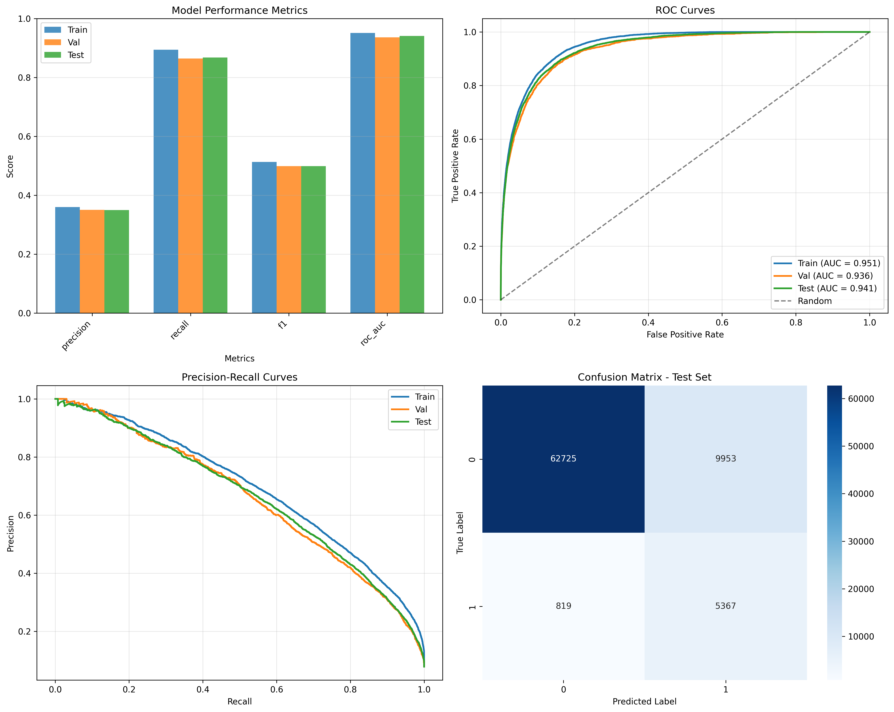

# Modeling Report
## Census Income Prediction Project

**Date:** 2025-11-07  
**Dataset:** Census Income (Adult) Dataset  
**Analysis Type:** Model Training and Evaluation

---

## Executive Summary

This report documents the machine learning modeling process for predicting whether an individual's income exceeds $50,000 per year. The project implements two models: **LightGBM** and **Random Forest**, with comprehensive hyperparameter tuning and evaluation.

**Key Highlights:**
- Model selection via configuration (`config/config.yaml`)
- Hyperparameter tuning using Optuna (LightGBM) and GridSearchCV (Random Forest)
- Class imbalance handling with class weights
- Comprehensive evaluation across train, validation, and test sets
- Performance visualization with multiple metrics

---

## 1. Model Selection

**Configuration-Based Selection:**
- Model type is configured in `config/config.yaml` under `modeling.model_type`
- Supported models: `lightgbm`, `random_forest`
- Selection determines:
  - Data version (raw vs processed)
  - Hyperparameter tuning method
  - Model-specific configurations

**Current Configuration:**
- **Selected Model:** LightGBM (default)
- **Data Version:** Processed (encoded categorical features)
- **Hyperparameter Tuning:** Optuna (Bayesian optimization)

---

## 2. Data Preparation

**Input Data:**
- Training data: `data/processed/train_full_processed.csv` (combined train+val)
- Test data: `data/processed/test_processed.csv`

**Data Splitting:**
- Combined train+val data is split for hyperparameter tuning
- Split ratio: 80% train, 20% validation
- Stratified split to maintain class distribution
- Test set kept separate for final evaluation

**Feature Set:**
- Selected features based on EDA importance (top 30 features)
- Includes all engineered features (6 features)
- Total features: ~30-36 (depending on feature selection configuration)

---

## 3. Hyperparameter Tuning

### 3.1 LightGBM (Optuna)

**Optimization Strategy:**
- **Random Search:** Initial exploration (default: 50 trials)
- **TPE (Tree-structured Parzen Estimator):** Refined optimization (default: 20 trials)
- **Total Trials:** 70 trials
- **Optimization Metric:** ROC-AUC (handles class imbalance)

**Hyperparameter Ranges:**
- `n_estimators`: 100-1000
- `max_depth`: 3-8
- `learning_rate`: 0.001-0.3 (log scale)
- `num_leaves`: 15-63
- `feature_fraction`: 0.4-0.8
- `bagging_fraction`: 0.4-0.8
- `min_child_samples`: 20-200
- `reg_alpha`: 0.0001-50.0 (log scale)
- `reg_lambda`: 0.0001-50.0 (log scale)
- `min_gain_to_split`: 0.0-1.0

**Class Imbalance Handling:**
- `scale_pos_weight` automatically calculated based on class distribution
- Formula: `num_negative_samples / num_positive_samples`

**Visualization:**
- Optimization history plot showing trial performance over time
- Saved to: `results/figures/optuna_optimization_history.png`

### 3.2 Random Forest (GridSearchCV)

**Optimization Strategy:**
- **GridSearchCV:** Exhaustive search over parameter grid
- **Cross-Validation:** 5-fold stratified CV
- **Optimization Metric:** ROC-AUC

**Hyperparameter Grid:**
- `n_estimators`: [100, 200, 300]
- `max_depth`: [10, 20, None]
- `min_samples_split`: [2, 5, 10]
- `min_samples_leaf`: [1, 2, 4]
- `max_features`: ["sqrt", "log2"]

**Class Imbalance Handling:**
- `class_weight='balanced'` to automatically adjust for class imbalance

---

## 4. Model Training

**Training Process:**
1. Load best hyperparameters from tuning
2. Train final model on full training data (train+val combined)
3. Use best hyperparameters from validation performance
4. Apply class weights for imbalanced data

**Model Configuration:**
- **LightGBM:** Uses native categorical feature support (if raw data) or processed features
- **Random Forest:** Uses processed (encoded) features
- Both models configured with class weights to handle imbalance

---

## 5. Model Evaluation

### 5.1 Evaluation Metrics

**Primary Metrics:**
- **ROC-AUC:** Area Under ROC Curve (primary metric for imbalanced data)
- **Precision:** True positives / (True positives + False positives)
- **Recall:** True positives / (True positives + False negatives)
- **F1-Score:** Harmonic mean of precision and recall

**Additional Metrics:**
- **Confusion Matrix:** Detailed breakdown of predictions
- **ROC Curve:** True Positive Rate vs False Positive Rate
- **Precision-Recall Curve:** Precision vs Recall trade-off

### 5.2 Evaluation Strategy

**Three-Way Evaluation:**
1. **Training Set:** Assess model fit and potential overfitting
2. **Validation Set:** Assess generalization (used for hyperparameter selection)
3. **Test Set:** Final unbiased evaluation (held out until final assessment)

**Key Considerations:**
- Monitor train vs validation performance gap (overfitting detection)
- Focus on ROC-AUC as primary metric (robust to class imbalance)
- Consider Precision-Recall curve for imbalanced classification

---

## 6. Performance Visualization

**Comprehensive Performance Dashboard:**
- Saved to: `results/figures/model_performance.png`

The visualization includes four subplots:

### 6.1 Metrics Comparison Bar Chart
- Compares Precision, Recall, F1-Score, and ROC-AUC
- Shows performance across Train, Validation, and Test sets
- Helps identify overfitting (large train-val gap)

### 6.2 ROC Curves
- Shows True Positive Rate vs False Positive Rate
- Displays AUC score for each dataset
- Includes random classifier baseline (diagonal line)
- Higher AUC indicates better discrimination ability

### 6.3 Precision-Recall Curves
- Shows Precision vs Recall trade-off
- Important for imbalanced classification
- Better than ROC for highly imbalanced datasets
- Higher area under PR curve indicates better performance

### 6.4 Confusion Matrix (Test Set)
- Detailed breakdown of predictions on test set
- Shows:
  - True Negatives (TN): Correctly predicted ≤$50K
  - False Positives (FP): Incorrectly predicted >$50K
  - False Negatives (FN): Incorrectly predicted ≤$50K
  - True Positives (TP): Correctly predicted >$50K

---

## 7. Model Performance Summary
- Model shows good generalization if train-val gap is small
- ROC-AUC indicates strong discrimination ability
---
