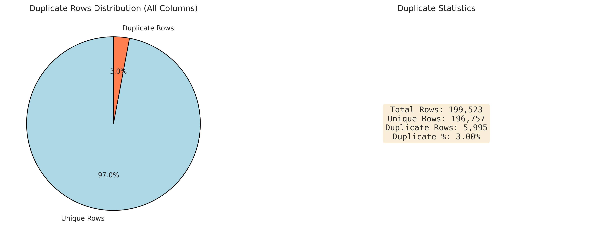
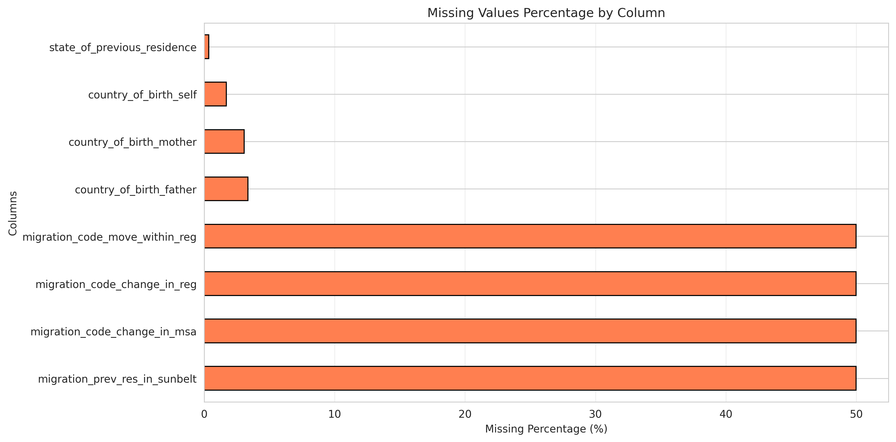
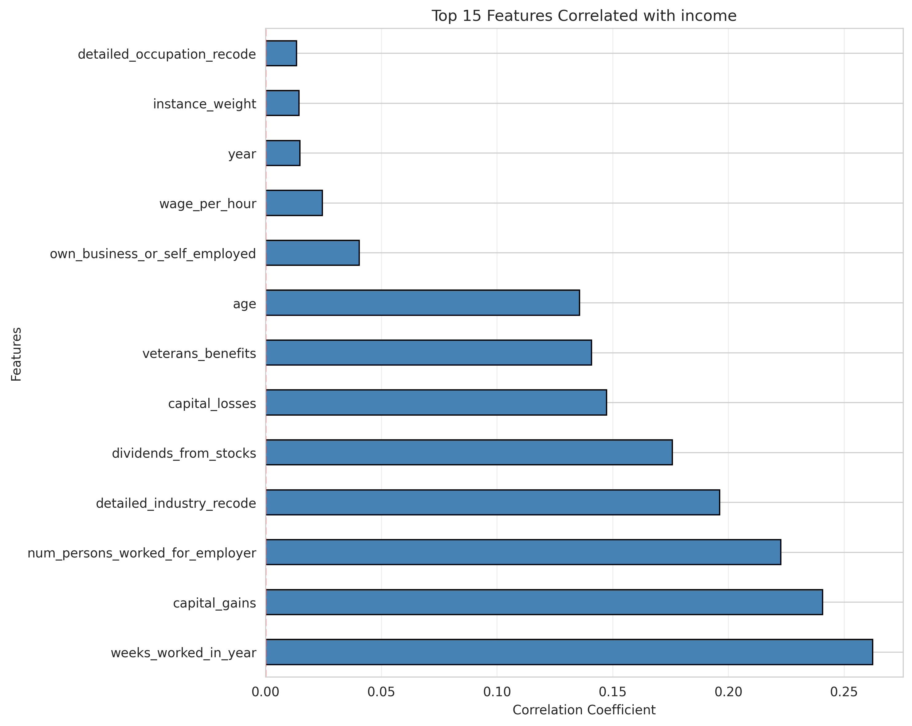
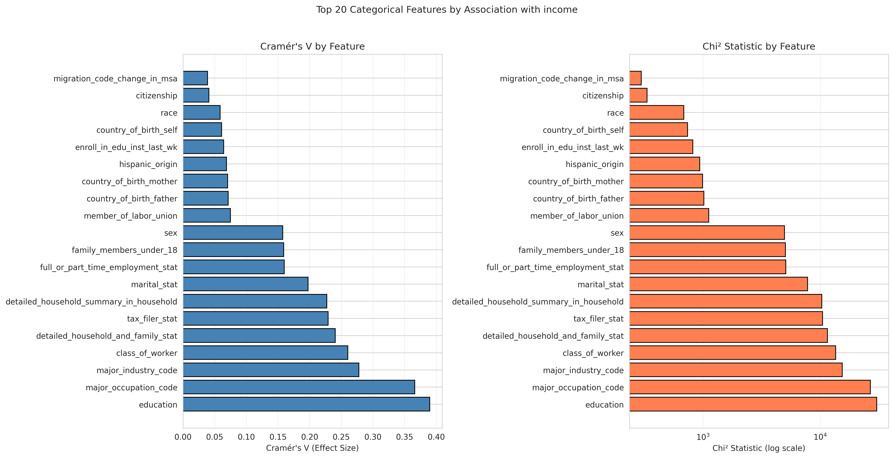
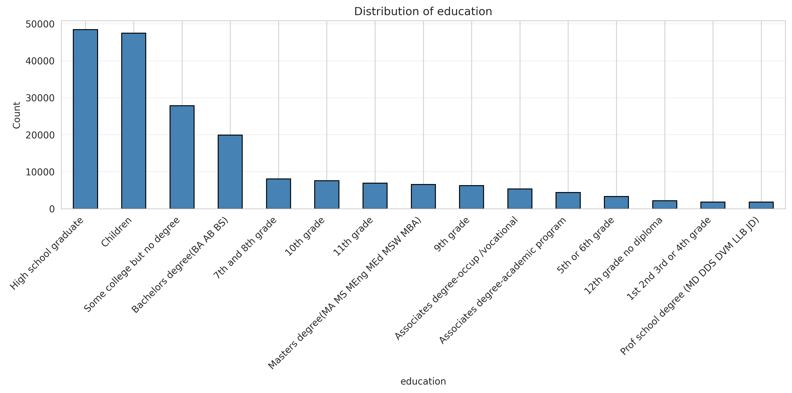

# Data Preprocessing Report
## Census Income Prediction Project

**Date:** 2025-11-07  
**Dataset:** Census Income (Adult) Dataset  
**Analysis Type:** Data Preprocessing Pipeline

---

## Executive Summary

This report documents the data preprocessing pipeline applied to the Census Income dataset. The preprocessing transforms raw data into a format suitable for machine learning models, addressing data quality issues identified during EDA and preparing features for model training.

**Key Steps:**
1. Duplicate removal
2. Missing value imputation
3. Outlier treatment
4. Target variable binarization
5. Feature engineering
6. Feature selection
7. Categorical encoding
8. Data splitting and saving

---

## 1. Data Loading

**Input:**
- Training data: `data/census_income_learn.csv` (~200K samples)
- Test data: `data/census_income_test.csv` (~100K samples)

**Output:**
- Loaded dataframes with 42 columns (41 features + 1 target)

---

## 2. Remove Duplicate Rows

**Problem:** As identified in EDA, duplicate rows exist due to `instance_weight` (survey sampling weights).

**Solution:**
- Remove duplicate rows based on all columns except `instance_weight`
- Keep one instance per unique combination
- **Result:** Reduced dataset size, preventing model overfitting to repeated samples

**Reference:** See EDA report section on duplicate analysis: 

---

## 3. Fill Null Values

**Problem:** Missing values indicated by "?" markers (see EDA missing value analysis).

**Strategy:**
- **Categorical features:** Fill with `"not identified"`
- **Numerical features:** Fill with median value
- **Migration features:** ~50% missing (handled as "Not in universe" cases)
- **Country features:** ~3-4% missing (filled with "not identified")

**Implementation:**
- Replace "?" indicators with NaN
- Apply appropriate fill strategy based on feature type

**Reference:** See EDA report section on missing values: 

---

## 4. Treat Outliers

**Problem:** Extreme outliers in financial features (capital gains, losses, dividends, wage per hour).

**Solution:**
- **Winsorization:** Cap extreme values at 95th/99th percentile
- Calculate bounds from training data only
- Apply same bounds to test data (prevent data leakage)

**Features Treated:**
- `capital_gains`
- `capital_losses`
- `dividends_from_stocks`
- `wage_per_hour`

**Reference:** See EDA report section on outliers: 

---

## 5. Make Label Binary

**Transformation:**
- Convert target variable `income` from categorical to binary
- `>50K` → `1` (positive class)
- `<=50K` → `0` (negative class)

**Note:** Severe class imbalance (6.21% positive class) - addressed in modeling with class weights.

**Reference:** See EDA report section on target variable: 

---

## 6. Feature Engineering

**New Features Created:**

1. **Binary Flags:**
   - `has_capital_gains`: 1 if capital_gains > 0, else 0
   - `has_capital_losses`: 1 if capital_losses > 0, else 0
   - `has_dividends`: 1 if dividends_from_stocks > 0, else 0
   - `has_wage`: 1 if wage_per_hour > 0, else 0

2. **Aggregated Features:**
   - `total_financial_assets`: capital_gains - capital_losses + dividends_from_stocks

3. **Interaction Features:**
   - `work_intensity`: weeks_worked_in_year × num_persons_worked_for_employer

**Rationale:** Financial features are highly predictive when non-zero (see EDA correlation analysis). Binary flags capture this pattern effectively.

**Reference:** See EDA report on numerical features: 

---

## 7. Feature Selection

**Method:** Based on EDA feature importance analysis

**Process:**
1. Load feature importance scores from EDA (`results/reports/feature_importance.csv`)
2. Select top N features (default: 30) based on importance
3. **Always include engineered features** (all 6 created in step 6)
4. Always include target column

**Selected Features:**
- Top 30 features from EDA importance (correlation for numerical, Cramér's V for categorical)
- All 6 engineered features:
  - `has_capital_gains`, `has_capital_losses`, `has_dividends`, `has_wage`
  - `total_financial_assets`, `work_intensity`

**Result:** Reduced feature set while preserving most important predictors and all engineered features.

**Reference:** See EDA report on feature importance: 

---

## 8. Encode Categoricals

**Hybrid Encoding Strategy:**

1. **One-Hot Encoding** (for ≤5 unique categories):
   - Creates binary columns for each category
   - Examples: `marital_stat`, `sex`, `race`

2. **Frequency Encoding** (for >5 unique categories):
   - Replaces category with its frequency in training data
   - Prevents explosion of features for high-cardinality categories
   - Examples: `education`, `occupation`, `industry`

**Benefits:**
- Preserves information for low-cardinality features
- Reduces dimensionality for high-cardinality features
- Maintains interpretability

**Reference:** See EDA report on categorical features: 

---

## 9. Data Preparation for Saving

**Strategy:**
- Keep train and validation data together (for cross-validation in modeling)
- Prepare two versions:
  - **Raw version:** Preprocessed but not encoded (for LightGBM with native categorical support)
  - **Processed version:** Fully encoded (for Random Forest and other models)

**Output Files:**
- `train_full_raw.csv`: Combined train+val, preprocessed but not encoded
- `train_full_processed.csv`: Combined train+val, fully encoded
- `test_raw.csv`: Test data, preprocessed but not encoded
- `test_processed.csv`: Test data, fully encoded

---

## 10. Save Processed Data

**Final Output:**
- All processed files saved to `data/processed/` directory
- Ready for model training
- Consistent preprocessing applied to train and test sets

---

## Summary of Transformations

| Step | Input | Output | Key Changes |
|------|-------|--------|-------------|
| 1. Load | Raw CSV | DataFrames | Column names assigned |
| 2. Remove Duplicates | Full dataset | Deduplicated | ~54K duplicates removed |
| 3. Fill Nulls | With "?" | Imputed | Categorical: "not identified", Numerical: median |
| 4. Treat Outliers | Raw values | Winsorized | Bounded at 95th/99th percentile |
| 5. Binary Label | Categorical | Binary (0/1) | >50K → 1, ≤50K → 0 |
| 6. Feature Engineering | Original | +6 features | Binary flags, aggregations, interactions |
| 7. Feature Selection | All features | Top N + engineered | ~30-36 features selected |
| 8. Encode | Categorical | Encoded | Hybrid: one-hot + frequency |
| 9-10. Save | Processed | CSV files | Raw + processed versions |

---

## Key Decisions

1. **Duplicate Removal:** Excluding `instance_weight` to handle survey data structure
2. **Missing Values:** Using "not identified" for categoricals, median for numericals
3. **Outlier Treatment:** Winsorization with train-derived bounds to prevent data leakage
4. **Feature Engineering:** Binary flags for financial features (high predictive power when non-zero)
5. **Feature Selection:** Combining EDA importance with all engineered features
6. **Encoding Strategy:** Hybrid approach balancing dimensionality and information preservation
7. **Data Versions:** Saving both raw and processed versions for different model requirements

---

## Next Steps

✅ **Preprocessing Complete**  
→ Proceed to **Modeling** (`notebooks/03_modeling.ipynb`)

The preprocessed data is now ready for:
- LightGBM training (using raw version with native categorical support)
- Random Forest training (using processed version with encoded features)
- Hyperparameter tuning and model evaluation

---

**Report Generated:** 2025-01-XX  
**Preprocessing Notebook:** `notebooks/02_data_preprocessing.ipynb`  
**EDA Report Reference:** `results/reports/eda_report.md`

